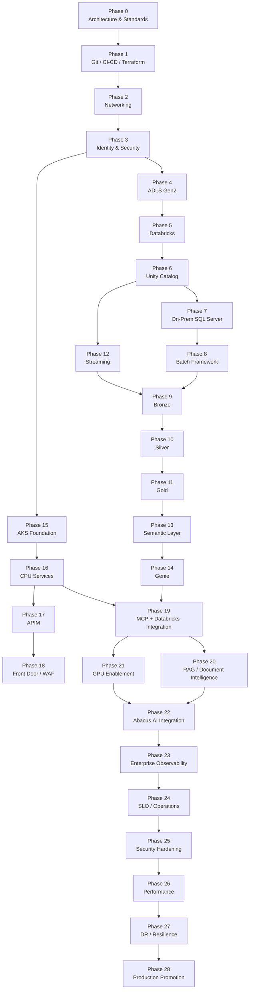

# Genie Insurance Platform
## Enterprise Implementation Roadmap

> **Purpose:** Define a controlled, phase-wise implementation strategy for the Genie Insurance Platform using enterprise platform engineering, data engineering, DevOps, security, and SRE practices.

## Project Architecture 


>
> **Delivery principle:** Each platform capability is designed, deployed, validated, operationalized, and approved independently before it is integrated with an existing environment.

---

## 1. Executive Summary

The Genie Insurance Platform is implemented as a sequence of **independently deployable platform capabilities**, not as a single large infrastructure release.

The delivery model is designed to:

- minimize deployment blast radius;
- reduce cross-platform dependencies;
- preserve clear ownership boundaries;
- validate security before application onboarding;
- establish observability before production promotion;
- make failures easier to isolate and recover;
- support controlled DEV → UAT → PROD promotion;
- keep infrastructure and application releases reproducible.

The implementation sequence is:

**Architecture → CI/CD Foundation → Networking → Identity & Security → Storage → Databricks → Unity Catalog → Hybrid Ingestion → Data Engineering → Streaming → Semantic Layer → Genie → AKS → API/MCP Integration → RAG/AI → GPU Enablement → Observability → Security Hardening → Performance → DR → Production**

---

## 2. Architecture Principles

### 2.1 Platform Responsibility Boundaries

| Platform / Service | Primary Responsibility |
|---|---|
| **Azure Databricks** | Data engineering, Spark, Structured Streaming, Delta Lake, SQL, ML engineering, semantic models, Genie |
| **AKS** | Containerized APIs, MCP services, AI orchestration, business microservices, RAG orchestration, event-driven application services |
| **ADLS Gen2** | Durable enterprise data storage |
| **Unity Catalog** | Data and AI governance, permissions, lineage, managed/external data access |
| **Azure Data Factory** | Hybrid and batch ingestion/orchestration |
| **Kafka / Azure Event Hubs** | Streaming and event ingestion |
| **Azure API Management** | Enterprise API governance and policy enforcement |
| **Azure Front Door + WAF** | External ingress, routing, edge security |
| **GitHub Actions** | CI/CD orchestration |
| **Terraform** | Azure infrastructure provisioning |
| **Databricks Declarative Automation Bundles** | Databricks workload deployment |
| **Helm** | AKS application deployment |
| **Azure Monitor / Log Analytics / Prometheus / Grafana** | Platform and application observability |

### 2.2 Design Rules

1. **Do not duplicate platform responsibilities.**
2. **Prefer managed identity and workload identity over stored credentials.**
3. **Use private connectivity for production data-plane services wherever practical.**
4. **Deploy infrastructure through code; avoid manual production configuration.**
5. **Promote immutable artifacts across environments.**
6. **Define integration contracts before connecting platforms.**
7. **Introduce GPUs only for workloads that demonstrate an accelerator requirement.**
8. **Require monitoring, rollback, and runbooks before production approval.**

---

## 3. Environment Model

The baseline enterprise environment model is:

```text
DEV  →  UAT  →  PROD
```

Each environment should have independent configuration and security boundaries for critical resources, including:

- resource groups;
- storage;
- Databricks workspaces;
- Unity Catalog bindings and grants;
- AKS clusters;
- Key Vaults;
- managed identities;
- Terraform state;
- GitHub Environments;
- monitoring and alert routing.

Additional **Sandbox**, **Integration**, **Performance**, or **DR** environments can be introduced without redesigning the repository.

---

## 4. Infrastructure and Repository Isolation

A recommended infrastructure layout is:

```text
infra/
├── bootstrap/
├── networking/
├── security/
├── storage/
├── databricks/
├── data-factory/
├── event-streaming/
├── acr/
├── aks/
├── api-management/
├── front-door/
├── monitoring/
└── disaster-recovery/
```

Separate Terraform state boundaries should be used where lifecycle, ownership, or blast-radius requirements justify isolation.

Application and platform code should remain separate from infrastructure definitions.

---

# Phase 0 — Architecture and Engineering Standards

## Objective

Establish architecture, non-functional requirements, security boundaries, naming standards, and operating assumptions before infrastructure deployment.

## Deliverables

- architecture diagrams;
- Architecture Decision Records;
- RTO/RPO targets;
- availability targets;
- data classification;
- expected batch and streaming volumes;
- API traffic assumptions;
- regional strategy;
- naming and tagging standards;
- repository conventions;
- IP/CIDR allocation;
- DEV/UAT/PROD model.

## Key Architecture Decisions

Typical ADRs:

```text
ADR-001  Azure Databricks as the lakehouse platform
ADR-002  ADLS Gen2 as persistent storage
ADR-003  Unity Catalog as the governance plane
ADR-004  Azure Data Factory for hybrid batch ingestion
ADR-005  Kafka/Event Hubs for streaming
ADR-006  AKS for application and MCP workloads
ADR-007  Azure API Management for API governance
ADR-008  GitHub Actions for CI/CD
ADR-009  Terraform for Azure infrastructure
ADR-010  OIDC / workload identity for CI/CD authentication
```

## Exit Gate

- architecture approved;
- non-functional requirements documented;
- environment strategy approved;
- security zones defined;
- naming/tagging standards approved;
- network ranges reserved.

---

# Phase 1 — Git, CI/CD, and Terraform Bootstrap

## Objective

Establish source control, change management, and deployment authentication before platform resources are created.

## Components

- GitHub repository;
- branch protection;
- pull requests;
- CODEOWNERS;
- GitHub Actions;
- GitHub Environments;
- GitHub OIDC;
- Terraform backend;
- security and linting checks.

## Pipeline Pattern

```text
Feature Branch
      ↓
Pull Request
      ↓
Formatting / Validation
      ↓
Security Checks
      ↓
Terraform Plan
      ↓
Peer Review
      ↓
Approved Merge
```

Production `apply` must be gated by an approved deployment workflow.

## Validation

```bash
terraform fmt -check
terraform validate
terraform plan
```

Validate:

- OIDC authentication;
- Terraform backend access;
- environment protection;
- approval controls;
- no long-lived Azure credentials in GitHub.

## Exit Gate

CI/CD can authenticate, validate infrastructure, generate plans, and enforce review controls.

---

# Phase 2 — Azure Landing Zone and Networking

## Objective

Create the network foundation required by all subsequent services.

## Components

- hub VNet;
- environment spoke VNets;
- subnets;
- NSGs;
- route tables;
- private DNS;
- Azure Firewall where required;
- controlled outbound connectivity;
- ExpressRoute / VPN integration.

## Target Pattern

```text
Enterprise Network
        |
ExpressRoute / VPN
        |
     Hub VNet
        |
  +-----+-----+
  |     |     |
 DEV   UAT   PROD
Spoke Spoke Spoke
```

## Validation

- hub/spoke routing;
- DNS resolution;
- NSG enforcement;
- outbound routing;
- firewall rules;
- ExpressRoute/VPN routing;
- subnet capacity.

## Exit Gate

Network design is stable and approved for dependent PaaS and AKS services.

---

# Phase 3 — Identity, Security, and Secrets Foundation

## Objective

Establish the security control plane before application and data workloads are onboarded.

## Components

- Microsoft Entra ID;
- Entra groups;
- managed identities;
- workload identity;
- service principals only where required;
- Azure RBAC;
- Azure Key Vault;
- Azure Policy;
- Defender for Cloud.

## Identity Patterns

Human access:

```text
User
  ↓
Entra Group
  ↓
RBAC / Platform Permissions
```

Application access:

```text
Workload
   ↓
Managed / Workload Identity
   ↓
Azure Resource
```

## Example Groups

```text
genie-platform-admins
genie-data-engineers
genie-data-scientists
genie-sre
genie-security
genie-claims-analysts
genie-business-users
```

## Exit Gate

- least-privilege access validated;
- managed identity access proven;
- unauthorized access denied;
- Key Vault access validated;
- audit logging enabled.

---

# Phase 4 — ADLS Gen2 Storage Foundation

## Objective

Deploy a secure persistent data layer independently of Databricks.

## Logical Layout

```text
ADLS Gen2
├── landing
├── bronze
├── silver
├── gold
├── quarantine
├── documents
├── streaming-checkpoints
└── operational
```

## Controls

- hierarchical namespace;
- disabled public access;
- private endpoints;
- storage firewall;
- RBAC;
- encryption;
- lifecycle management;
- diagnostic logging.

## Validation

- authorized read/write;
- unauthorized access denial;
- private DNS resolution;
- lifecycle behavior;
- diagnostic log delivery.

## Exit Gate

Storage is secure, private, observable, and Terraform-managed.

---

# Phase 5 — Azure Databricks Platform Foundation

## Objective

Deploy Databricks as the governed enterprise data and analytics processing platform.

## Components

- Azure Databricks workspace;
- private networking;
- access connector;
- compute policies;
- SQL warehouse strategy;
- workspace identity;
- audit/system logging.

## Scope Boundary

Do **not** deploy production pipelines, Genie, or AKS integration in this phase.

## Validation

- workspace access;
- compute startup;
- SQL warehouse operation;
- private resource connectivity;
- approved identity access;
- audit visibility.

## Exit Gate

Databricks is certified as a platform dependency.

---

# Phase 6 — Unity Catalog Governance

## Objective

Establish governance before production datasets are onboarded.

## Components

- metastore;
- catalogs;
- schemas;
- storage credentials;
- external locations;
- managed tables;
- volumes;
- grants;
- lineage.

## Logical Model

```text
genie_<environment>
├── bronze
├── silver
├── gold
├── semantic
├── ml
└── operations
```

## Secure Storage Access

```text
Databricks
    ↓
Unity Catalog
    ↓
Access Connector
    ↓
Managed Identity
    ↓
ADLS Gen2
```

## Validation

- catalog isolation;
- managed/external table access;
- external locations;
- privilege boundaries;
- lineage capture;
- unauthorized access rejection.

## Exit Gate

Governance controls are operational and approved.

---

# Phase 7 — On-Prem SQL Server Hybrid Ingestion

## Objective

Prove the first complete source-to-cloud ingestion pattern using on-premises SQL Server.

## Components

- on-prem SQL Server;
- Azure Data Factory;
- Self-hosted Integration Runtime;
- ExpressRoute or site-to-site VPN;
- ADLS landing/Bronze.

## Flow

```text
On-Prem SQL Server
        ↓
Self-hosted Integration Runtime
        ↓
ExpressRoute / VPN
        ↓
Azure Data Factory
        ↓
ADLS Landing / Bronze
```

## Implementation Increments

### Increment 1 — Connectivity
- query controlled test data;
- validate firewall and routing;
- validate authentication.

### Increment 2 — Production Ingestion Pattern
- incremental extraction;
- watermarks;
- retries;
- batch IDs;
- audit records;
- reconciliation.

### Increment 3 — High Availability
- multiple Self-hosted Integration Runtime nodes;
- failure/recovery testing;
- throughput testing.

## Exit Gate

- source-to-target reconciliation passes;
- replay is validated;
- incremental processing is idempotent;
- SHIR failure recovery is proven.

---

# Phase 8 — Reusable Batch Ingestion Framework

## Objective

Convert the SQL Server implementation into a reusable enterprise ingestion framework.

## Supported Sources

- SQL Server;
- Oracle;
- SFTP;
- APIs;
- CSV;
- JSON;
- XML;
- approved SaaS sources.

## Metadata-Driven Configuration

```text
source_system
source_object
target_object
load_type
watermark_column
schedule
schema
retention
recovery_policy
```

## Design Rule

Onboard new batch sources primarily through reusable patterns and metadata, not custom pipeline duplication.

## Exit Gate

A new source can be integrated using the standardized framework with minimal custom code.

---

# Phase 9 — Bronze Data Engineering

## Objective

Create replayable raw data products with operational metadata.

## Example Tables

```text
bronze.claim
bronze.claim_line
bronze.payment
bronze.member
bronze.provider
bronze.policy
```

## Required Metadata

```text
_ingestion_timestamp
_source_system
_source_file
_batch_id
_record_hash
_load_date
```

## Exit Gate

Bronze supports:

- replay;
- source reconciliation;
- auditing;
- historical investigation;
- downstream restart.

---

# Phase 10 — Silver Quality and Conformance

## Objective

Create validated, standardized, trusted enterprise data.

## Controls

- schema validation;
- type validation;
- deduplication;
- null checks;
- referential integrity;
- canonical formats;
- business rules;
- quarantine;
- reconciliation;
- deterministic MERGE.

## Pattern

```text
bronze.claim
     |
     +---- valid ----> silver.claim
     |
     +---- invalid --> quarantine.claim
```

## Quality Metrics

- valid record percentage;
- duplicate rate;
- quarantine count;
- freshness;
- reconciliation variance.

## Exit Gate

Silver data passes defined quality thresholds and restart/replay tests.

---

# Phase 11 — Gold Insurance Data Products

## Objective

Create business-ready domain models and certified data products.

## Core Models

```text
gold.claim_fact
gold.claim_line_fact
gold.payment_fact
gold.policy_fact

gold.member_dim
gold.provider_dim
gold.policy_dim
gold.product_dim
gold.date_dim
```

## Payment Integrity Models

```text
gold.duplicate_claim
gold.overpayment
gold.underpayment
gold.excessive_units
gold.out_of_network
gold.aging_claim
```

## Data Product Requirements

Every Gold product must define:

- grain;
- business owner;
- technical owner;
- SLA/SLO;
- quality rules;
- lineage;
- retention;
- certified consumers.

## Exit Gate

Gold products are certified for analytics and semantic consumption.

---

# Phase 12 — Streaming Platform

## Objective

Introduce event-driven processing after batch/lakehouse foundations are operational.

## Components

- Apache Kafka and/or Azure Event Hubs;
- Databricks Structured Streaming;
- Delta checkpoints.

## Initial Event

```text
CLAIM_CREATED
```

## Flow

```text
Producer
   ↓
Kafka / Event Hubs
   ↓
Databricks Structured Streaming
   ↓
Bronze Delta
   ↓
Silver / Gold
```

## Validation

- checkpoint recovery;
- event replay;
- duplicate handling;
- event-time processing;
- late-arriving events;
- schema evolution;
- consumer lag.

## Exit Gate

One production-grade stream is proven before additional event types are onboarded.

---

# Phase 13 — Semantic and Metrics Layer

## Objective

Create governed and reusable business definitions over certified Gold data.

## Components

- certified views;
- dimensions;
- metric views;
- KPIs;
- business terminology;
- approved relationships.

## Example Metrics

```text
Claim Count
Allowed Amount
Paid Amount
Duplicate Payment Amount
Overpayment Amount
Average Processing Time
Policy Retention Rate
```

## Exit Gate

Business metrics are consistently defined and approved for analytical and AI consumption.

---

# Phase 14 — Databricks Genie

## Objective

Enable governed natural-language analytics over certified semantic data.

## Implementation Sequence

### Increment 1
Deploy Genie for the **Claims** domain only.

### Increment 2
Create a benchmark suite:

```text
Question
Expected SQL
Expected Result
Tolerance
```

### Increment 3
Add additional approved domains:

- payments;
- providers;
- policies;
- payment integrity.

## Controls

- approved tables/views only;
- documented joins;
- business terminology;
- validated SQL;
- benchmark testing;
- Unity Catalog authorization.

## Exit Gate

Genie meets accuracy, security, and performance criteria for approved domains.

---

# Phase 15 — AKS Platform Foundation

## Objective

Deploy AKS as an independent enterprise application runtime.

## Components

- private AKS cluster;
- system node pool;
- CPU application node pool;
- Microsoft Entra integration;
- workload identity;
- network policy;
- Azure Container Registry;
- ingress;
- autoscaling;
- monitoring.

## Initial Deployment

Deploy only a health service:

```http
GET /health
```

## CI/CD Flow

```text
GitHub
   ↓
Build
   ↓
Scan
   ↓
ACR
   ↓
Helm
   ↓
AKS
```

## Validation

- rolling deployment;
- rollback;
- autoscaling;
- pod restart;
- node disruption;
- probes;
- identity;
- logging.

## Exit Gate

AKS operates independently as a certified application platform.

---

# Phase 16 — AKS CPU Application Services

## Objective

Deploy business and integration workloads on CPU node pools.

## Candidate Services

```text
mcp-service
agent-orchestrator
claims-api
payment-api
provider-api
notification-service
integration-service
event-consumer
```

## CPU Workload Scope

Use CPU pools for:

- REST/gRPC APIs;
- MCP;
- orchestration;
- routing;
- workflows;
- Kafka consumers;
- metadata services;
- standard RAG orchestration.

## Exit Gate

Application services meet availability, scaling, security, and observability requirements.

---

# Phase 17 — Azure API Management

## Objective

Create the controlled enterprise API boundary.

## Flow

```text
Client
  ↓
Azure API Management
  ↓
AKS Ingress
  ↓
AKS Service
```

## Capabilities

- OAuth/OIDC validation;
- throttling;
- quotas;
- versioning;
- routing;
- API policies;
- request correlation;
- centralized API logging.

## Design Rule

APIM remains the enterprise API-management layer. AKS ingress handles cluster routing only.

## Exit Gate

Private APIs can be securely governed through APIM.

---

# Phase 18 — Azure Front Door and WAF

## Objective

Add controlled external access after private APIs are operational.

## Flow

```text
Internet
   ↓
Azure Front Door
   ↓
WAF
   ↓
Azure API Management
   ↓
Private AKS
```

## Validation

- TLS;
- WAF rules;
- blocked malicious requests;
- API authentication;
- throttling;
- backend isolation;
- failover routing where applicable.

## Exit Gate

External access is secured and policy-controlled.

---

# Phase 19 — MCP and Databricks Integration

## Objective

Integrate the independently validated AKS application plane with the Databricks data intelligence plane.

## Flow

```text
Client / AI Application
        ↓
Front Door / APIM
        ↓
AKS MCP Service
        ↓
Approved Databricks Capability
        ↓
Genie / SQL / Governed Data Service
```

## Approved Tool Pattern

Prefer explicit capabilities:

```text
ask_genie
query_claim_metrics
query_payment_integrity
get_provider_summary
retrieve_policy_context
```

Avoid unrestricted tools such as:

```text
execute_any_sql
read_any_storage_path
```

## Validation

- authentication;
- authorization;
- user/service context;
- Unity Catalog permissions;
- auditability;
- timeout/retry behavior;
- response validation.

## Exit Gate

AI/application access is constrained to approved governed capabilities.

---

# Phase 20 — RAG and Document Intelligence

## Objective

Add governed unstructured-data retrieval without bypassing the data governance model.

## Sources

- policy documents;
- provider contracts;
- claim documents;
- procedures;
- operational runbooks;
- enterprise knowledge articles.

## Flow

```text
Document
   ↓
Parsing
   ↓
Chunking
   ↓
Metadata
   ↓
Embeddings
   ↓
Vector Index
   ↓
RAG Retrieval
```

## Required Metadata

Each indexed chunk should retain:

- source document;
- domain;
- classification;
- owner;
- effective date;
- access classification;
- lineage reference.

## Exit Gate

Retrieval results are governed, traceable, and permission-aware.

---

# Phase 21 — GPU Enablement

## Objective

Introduce accelerator compute only where performance testing proves a requirement.

## Databricks GPU Workloads

Use Databricks GPU compute for:

- distributed model training;
- fine-tuning;
- deep learning;
- large batch inference;
- model evaluation.

## AKS GPU Workloads

Use dedicated AKS GPU node pools for:

- low-latency custom model inference;
- always-on inference;
- embeddings at scale;
- vision inference;
- OCR;
- specialized containerized models.

## AKS Node Pool Model

```text
AKS
├── system-node-pool
├── cpu-application-pool
└── gpu-inference-pool
```

## Design Rule

Do not run ordinary APIs, MCP, orchestration, or standard event consumers on GPU nodes.

## Exit Gate

GPU adoption is justified by measured latency, throughput, utilization, and cost.

---

# Phase 22 — Abacus.AI Integration

## Objective

Integrate the external AI/conversational layer through governed enterprise interfaces.

## Recommended Boundary

```text
Abacus.AI
    ↓
Enterprise API / MCP Boundary
    ↓
AKS
    ↓
Databricks / Approved Services
```

## Design Rule

Do not provide unrestricted direct access from external AI tooling to:

- ADLS;
- raw production databases;
- uncontrolled Databricks SQL;
- ungoverned storage paths.

## Exit Gate

AI integration respects existing identity, authorization, auditing, and governance controls.

---

# Phase 23 — Enterprise Observability

## Objective

Consolidate infrastructure, data, API, application, and AI telemetry into an SRE operating model.

## Components

- Azure Monitor;
- Log Analytics;
- Application Insights;
- Prometheus;
- Grafana;
- Databricks system/audit telemetry;
- ADF monitoring;
- APIM logs;
- AKS logs;
- network diagnostics.

## Core Signals

### Application Golden Signals

- latency;
- traffic;
- errors;
- saturation.

### Data Platform Signals

- data freshness;
- reconciliation;
- data quality;
- pipeline duration;
- records processed;
- streaming lag;
- quarantine rate;
- Databricks job failures;
- SQL latency;
- Genie benchmark success;
- MCP latency;
- GPU utilization.

## Exit Gate

Operational teams can detect, diagnose, and alert on failures across the end-to-end flow.

---

# Phase 24 — SLOs and Production Operations

## Objective

Define measurable reliability targets and operational response procedures.

## Example SLOs

| Service | Example Objective |
|---|---|
| Claims ingestion freshness | 99% within 30 minutes |
| MCP availability | ≥ 99.9% |
| Claims API P95 latency | < 500 ms |
| Critical pipeline success | ≥ 99.5% |
| Production reconciliation | ≥ 99.99% |

## Required Runbooks

```text
runbooks/
├── adf-ingestion-failure.md
├── sql-connectivity-failure.md
├── databricks-job-failure.md
├── streaming-lag.md
├── aks-pod-failure.md
├── api-latency.md
├── genie-validation-failure.md
├── gpu-capacity.md
└── regional-failure.md
```

## Exit Gate

Alerts map to documented ownership and tested runbooks.

---

# Phase 25 — Security Hardening

## Objective

Move from functional implementation to production security certification.

## Activities

- Azure RBAC review;
- Unity Catalog privilege review;
- network security validation;
- container image scanning;
- dependency scanning;
- Terraform scanning;
- AKS workload identity review;
- Key Vault access review;
- APIM authentication review;
- storage access review;
- audit log validation;
- privileged access review;
- penetration testing where required.

## Exit Gate

Critical and high-severity security findings are resolved or formally accepted.

---

# Phase 26 — Performance and Scalability Engineering

## Objective

Validate scaling behavior by layer before production.

## Data Workloads

Test representative production volumes and concurrency.

## Streaming

Measure:

- events/second;
- consumer lag;
- partition scaling;
- checkpoint recovery.

## APIs

Measure:

- requests/second;
- P50;
- P95;
- P99;
- error rate.

## AKS

Validate:

- HPA;
- cluster autoscaler;
- node saturation;
- PodDisruptionBudgets;
- rolling deployments;
- failure recovery.

## GPU

Measure:

- inference latency;
- throughput;
- GPU utilization;
- GPU memory;
- concurrency;
- cost/request.

## Exit Gate

Capacity and autoscaling thresholds are documented and validated.

---

# Phase 27 — Resilience and Disaster Recovery

## Objective

Validate recovery behavior based on approved RTO/RPO requirements.

## Failure Scenarios

Test:

```text
ADF pipeline failure
SHIR node failure
ExpressRoute failure
AKS pod/node failure
Databricks job failure
Kafka/Event Hubs consumer failure
storage connectivity failure
identity failure
regional dependency failure
```

## Design Rule

Do not introduce multi-region active/active complexity unless business availability requirements justify it.

## Exit Gate

Recovery procedures are tested and measured against RTO/RPO.

---

# Phase 28 — Production Promotion

## Objective

Promote tested artifacts without manually recreating environments.

## Promotion Model

```text
Source Code
    ↓
Build Once
    ↓
Immutable Artifacts
    ├── Terraform version
    ├── Container image digest
    ├── Databricks bundle version
    └── Helm chart version
    ↓
DEV
    ↓
Validation
    ↓
UAT
    ↓
Validation / Approval
    ↓
PROD
```

Production configuration differs by environment.

Production source code should not be separately rewritten.

## Exit Gate

Production release is approved, traceable, reproducible, observable, and rollback-capable.

---

# 5. Platform Dependency Roadmap



---

# 6. Agile Delivery Model

A two-week sprint cadence can be used, but phases should be completed based on engineering readiness rather than calendar pressure.

Every capability progresses through four delivery states.

## 6.1 Foundation

- Terraform and configuration;
- network integration;
- identity;
- base service deployment.

## 6.2 Functional Validation

- unit/smoke tests;
- connectivity;
- security;
- failure-path validation.

## 6.3 Integration

Connect the capability only to previously certified services through defined contracts.

Example:

```text
ADF
 ↓
ADLS
 ↓
Databricks
```

## 6.4 Operationalization

- logs;
- metrics;
- alerts;
- dashboards;
- runbooks;
- SLOs;
- rollback;
- production approval.

---

# 7. Definition of Done

A phase is complete only when all applicable criteria are satisfied:

- infrastructure is deployed through code;
- configuration is version controlled;
- security controls are validated;
- automated tests pass;
- observability is enabled;
- failure scenarios are tested;
- rollback is documented;
- runbooks are published;
- architecture documentation is updated;
- peer review is complete;
- integration contracts are documented;
- production promotion criteria are defined.

A successfully created Azure resource is **not** considered a completed platform capability.

---

# 8. Engineering Ownership Model

| Function | Primary Responsibilities |
|---|---|
| **Solution Architecture** | Architecture boundaries, ADRs, NFRs, standards, integration patterns, technology rationalization |
| **Platform Engineering** | Landing zone, networking, identity integration, Databricks platform, AKS, storage, reusable Terraform |
| **Data Engineering** | Ingestion, Bronze/Silver/Gold, Spark, streaming, data contracts, reconciliation, data products |
| **DevOps** | GitHub, OIDC, CI/CD, Terraform pipelines, Helm, release promotion, deployment controls |
| **SRE** | SLOs, observability, capacity, reliability, incidents, runbooks, recovery testing |
| **Security Engineering** | IAM, RBAC, network policy, vulnerability management, audit controls, production security approval |
| **Data Governance** | Unity Catalog structure, ownership, classification, access policy, lineage, certification |

---

# 9. Technology Adoption Gate

Any new service or technology must answer the following before adoption:

1. **What capability is missing from the current platform?**
2. **Why can an approved service not satisfy that requirement?**
3. **What interface or contract will the new component expose?**
4. **How will it be authenticated, authorized, monitored, deployed, and recovered?**
5. **What operational, security, scalability, and cost impact does it introduce?**

A technology should not be introduced solely to increase tool coverage.

---

# 10. Final Target Architecture Flow

## Batch / Hybrid Data Path

```text
On-Prem SQL Server / Enterprise Sources
        ↓
Self-hosted Integration Runtime
        ↓
Azure Data Factory
        ↓
ADLS Gen2
        ↓
Databricks Bronze
        ↓
Databricks Silver
        ↓
Databricks Gold
        ↓
Semantic Layer / Metric Views
        ↓
Genie / SQL / ML
```

## Streaming Path

```text
Applications / Events
        ↓
Kafka / Azure Event Hubs
        ↓
Databricks Structured Streaming
        ↓
Bronze
        ↓
Silver
        ↓
Gold
```

## Application / AI Path

```text
Users / Enterprise Apps / Abacus.AI
        ↓
Azure Front Door + WAF
        ↓
Azure API Management
        ↓
AKS
        ├── MCP
        ├── APIs
        ├── AI Orchestration
        ├── RAG Services
        └── Event Services
        ↓
Approved Databricks / Genie / SQL / Vector Capabilities
        ↓
Unity Catalog Governed Data
```

## Compute Strategy

```text
Databricks CPU
  → Spark ETL
  → SQL
  → Streaming
  → Delta processing

Databricks GPU
  → Distributed ML training
  → Fine-tuning
  → Batch inference

AKS CPU
  → APIs
  → MCP
  → Microservices
  → Agents
  → Workflow and event services

AKS GPU
  → Low-latency inference
  → Vision / OCR
  → Embeddings
  → Specialized model serving
```

---

# 11. Delivery Standard

The Genie Insurance Platform is implemented using a controlled incremental engineering model:

> **Design the capability → deploy it independently → validate security and operations → define the integration contract → integrate with the existing environment → regression test → approve → promote.**

This approach prevents the platform from becoming a tightly coupled collection of cloud services and establishes clear operational boundaries across **networking, security, data engineering, application engineering, AI, DevOps, and SRE**.

The result is a platform that can be evolved, tested, secured, scaled, and recovered one capability at a time without destabilizing previously certified components.

---

# 12. Implementation Order and Validation Strategy

The platform must be implemented in dependency order. A later phase should not become a hard dependency until the previous phase has passed its independent validation and integration gate.

## 12.1 Recommended Implementation Sequence

| Order | Phase | Implement First / Next | Primary Dependency |
|---:|---|---|---|
| 1 | Phase 0 | Architecture & Engineering Standards | None |
| 2 | Phase 1 | Git / CI/CD / Terraform Bootstrap | Phase 0 |
| 3 | Phase 2 | Landing Zone & Networking | Phase 1 |
| 4 | Phase 3 | Identity, Security & Secrets | Phase 2 |
| 5 | Phase 4 | ADLS Gen2 Storage | Phase 3 |
| 6 | Phase 5 | Azure Databricks Platform | Phase 4 |
| 7 | Phase 6 | Unity Catalog Governance | Phase 5 |
| 8 | Phase 7 | On-Prem SQL Server Hybrid Ingestion | Phase 6 |
| 9 | Phase 8 | Reusable Batch Ingestion Framework | Phase 7 |
| 10 | Phase 9 | Bronze Data Engineering | Phase 8 |
| 11 | Phase 10 | Silver Quality & Conformance | Phase 9 |
| 12 | Phase 11 | Gold Insurance Data Products | Phase 10 |
| 13 | Phase 12 | Streaming Platform | Phase 6, then integrates with Bronze/Silver/Gold |
| 14 | Phase 13 | Semantic / Metrics Layer | Phase 11 |
| 15 | Phase 14 | Databricks Genie | Phase 13 |
| 16 | Phase 15 | AKS Platform Foundation | Phase 3; can be built in parallel after core security/network foundations |
| 17 | Phase 16 | AKS CPU Services | Phase 15 |
| 18 | Phase 17 | API Management | Phase 16 |
| 19 | Phase 18 | Front Door + WAF | Phase 17 |
| 20 | Phase 19 | MCP ↔ Databricks Integration | Phases 14 and 16 |
| 21 | Phase 20 | RAG / Document Intelligence | Phase 19 |
| 22 | Phase 21 | GPU Enablement | Phase 20 or measured model-serving need |
| 23 | Phase 22 | Abacus.AI Integration | Phase 19; RAG optional depending on use case |
| 24 | Phase 23 | Enterprise Observability Consolidation | Begins earlier; formal consolidation here |
| 25 | Phase 24 | SLOs & Production Operations | Phase 23 |
| 26 | Phase 25 | Security Hardening | All implemented production-path components |
| 27 | Phase 26 | Performance & Scalability | Functional platform complete |
| 28 | Phase 27 | Resilience & DR | Performance baseline established |
| 29 | Phase 28 | Production Promotion | All release gates passed |

> **Important:** Observability, security logging, and CI/CD controls are introduced from the beginning. Phases 23–25 consolidate and certify them across the full platform.

---

## 12.2 Phase-by-Phase Test and Integration Matrix

### Phase 0 — Architecture & Standards

**Independent validation**

- Architecture review completed.
- ADRs approved.
- RTO/RPO documented.
- IP ranges reserved.
- naming and tagging standards validated.
- environment boundaries confirmed.

**Combined validation**

No runtime integration test is required yet. Validate that every later phase has a defined owner, dependency, security boundary, and acceptance criterion.

**Pass condition**

No infrastructure deployment begins until unresolved architecture blockers are closed.

---

### Phase 1 — Git / CI/CD / Terraform Bootstrap

**Independent validation**

Run:

```bash
terraform fmt -check
terraform validate
terraform plan
git diff --check
```

Validate:

- protected branch behavior;
- pull-request review;
- GitHub Environment approvals;
- OIDC authentication;
- Terraform backend read/write;
- no static Azure credentials.

**Combined validation**

Execute a controlled Terraform plan against the DEV subscription using GitHub Actions and confirm:

```text
GitHub Actions
      ↓
OIDC
      ↓
Microsoft Entra ID
      ↓
Azure Subscription
      ↓
Terraform Backend
```

**Pass condition**

CI can plan infrastructure securely without a client secret.

---

### Phase 2 — Landing Zone & Networking

**Independent validation**

Test:

- hub-to-spoke routing;
- DNS resolution;
- NSG allow/deny behavior;
- private DNS;
- NAT/firewall egress;
- route tables;
- ExpressRoute or VPN route propagation.

Typical tools:

```bash
az network vnet list
az network vnet subnet list
az network nsg list
nslookup <private-endpoint-fqdn>
nc -vz <host> <port>
```

**Combined validation**

Run the same network tests from a controlled workload or test VM in the spoke network.

Validate:

```text
DEV Spoke
   ↓
Hub
   ↓
Shared Services / On-Premises
```

**Pass condition**

Required routes work and explicitly unauthorized routes fail.

---

### Phase 3 — Identity, Security & Secrets

**Independent validation**

Test:

- RBAC assignment;
- managed identity token acquisition;
- Key Vault access;
- unauthorized identity denial;
- Azure Policy enforcement;
- audit-log generation.

**Combined validation**

Use the GitHub/Terraform identity created in Phase 1 to deploy or read only the resources allowed by Phase 3 permissions.

Validate:

```text
GitHub OIDC
   ↓
Entra Federation
   ↓
Azure RBAC
   ↓
Allowed Resource
```

and confirm denied operations fail.

**Pass condition**

Least privilege is demonstrable, not assumed.

---

### Phase 4 — ADLS Gen2

**Independent validation**

Test:

- private endpoint resolution;
- authorized upload/download;
- unauthorized user denial;
- public access disabled;
- diagnostic logs;
- lifecycle policy.

**Combined validation**

Validate from the approved VNet and identity path:

```text
Approved Identity
      ↓
Private Network
      ↓
ADLS Gen2
```

Create a test object in `landing/`, read it, and remove it.

**Pass condition**

Storage is reachable only through approved network and identity paths.

---

### Phase 5 — Azure Databricks Platform

**Independent validation**

Test:

- workspace login;
- cluster/serverless/SQL startup according to design;
- notebook execution;
- SQL warehouse execution;
- diagnostic/audit visibility;
- network access controls.

Example smoke workload:

```python
spark.range(10).count()
```

**Combined validation**

Validate:

```text
Databricks
    ↓
Private Network
    ↓
ADLS / Approved Azure Services
```

Do not yet test production transformations.

**Pass condition**

Databricks compute operates successfully inside the approved security boundary.

---

### Phase 6 — Unity Catalog

**Independent validation**

Test:

- catalog/schema creation;
- storage credentials;
- external locations;
- managed tables;
- volumes;
- grants;
- lineage.

Example checks:

```sql
SHOW CATALOGS;
SHOW SCHEMAS IN genie_dev;
SHOW GRANTS ON CATALOG genie_dev;
```

**Combined validation**

Validate the complete governed path:

```text
Databricks User
      ↓
Unity Catalog Permission
      ↓
Storage Credential
      ↓
Managed Identity
      ↓
ADLS
```

Test both authorized and unauthorized users.

**Pass condition**

Data access is controlled through Unity Catalog rather than direct unmanaged storage access.

---

### Phase 7 — On-Prem SQL Server Hybrid Ingestion

**Independent validation**

Start with a controlled query and small dataset.

Validate:

- Self-hosted IR online;
- SQL authentication/identity;
- network path;
- ADF connection;
- copy to landing area.

Reconcile:

```text
Source row count
=
Target row count
```

**Combined validation**

Test:

```text
On-Prem SQL Server
        ↓
Self-hosted IR
        ↓
ExpressRoute / VPN
        ↓
ADF
        ↓
ADLS Landing
```

Then simulate:

- SHIR restart;
- transient SQL failure;
- retry;
- pipeline rerun.

**Pass condition**

The same batch can be safely rerun without corruption or untracked duplication.

---

### Phase 8 — Reusable Batch Framework

**Independent validation**

Onboard a second source/table using configuration rather than a new custom pipeline.

Test:

- full load;
- incremental load;
- watermark;
- retry;
- schema mismatch;
- empty source;
- duplicate source rows.

**Combined validation**

Validate multiple source objects use the same framework and create consistent audit records.

**Pass condition**

New batch onboarding does not require redesigning the ingestion architecture.

---

### Phase 9 — Bronze

**Independent validation**

Verify:

- source columns preserved;
- ingestion metadata present;
- record count reconciled;
- raw values retained;
- rerun behavior.

Example:

```sql
SELECT
  COUNT(*),
  MIN(_ingestion_timestamp),
  MAX(_ingestion_timestamp)
FROM bronze.claim;
```

**Combined validation**

Test:

```text
SQL Server
   ↓
ADF
   ↓
ADLS
   ↓
Bronze Delta
```

Compare source, landing, and Bronze counts.

**Pass condition**

Bronze is complete, traceable, replayable, and source-aligned.

---

### Phase 10 — Silver

**Independent validation**

Create test records covering:

- valid record;
- duplicate;
- missing required value;
- invalid type;
- invalid foreign key;
- late update.

Validate expected routing to:

```text
silver.*
quarantine.*
```

**Combined validation**

Run:

```text
Bronze
   ↓
Validation
   ↓
Silver / Quarantine
```

Validate:

```text
Bronze count
=
Silver accepted
+
Quarantine rejected
± explicitly documented deduplication
```

**Pass condition**

Quality outcomes are deterministic and measurable.

---

### Phase 11 — Gold

**Independent validation**

Test:

- grain;
- join cardinality;
- aggregate correctness;
- slowly changing dimensions where applicable;
- payment-integrity calculations.

Example reconciliation:

```text
Gold paid amount
=
Approved Silver payment totals
```

within documented business rules.

**Combined validation**

Test:

```text
Source
 ↓
Bronze
 ↓
Silver
 ↓
Gold
```

Perform end-to-end financial reconciliation for a controlled date range.

**Pass condition**

Certified business measures reconcile to approved source/control totals.

---

### Phase 12 — Streaming

**Independent validation**

Test one event type first.

Validate:

- event ingestion;
- checkpoint creation;
- restart;
- replay;
- duplicate event handling;
- out-of-order event;
- late event;
- schema evolution.

**Combined validation**

Test:

```text
Producer
   ↓
Kafka / Event Hubs
   ↓
Structured Streaming
   ↓
Bronze
   ↓
Silver
   ↓
Gold
```

Stop the stream, publish additional events, restart, and verify no unacceptable loss or duplication.

**Pass condition**

Streaming survives restart and reprocessing scenarios.

---

### Phase 13 — Semantic / Metrics Layer

**Independent validation**

For each KPI, validate SQL against a certified Gold control query.

Examples:

- claim count;
- paid amount;
- overpayment amount;
- policy retention.

**Combined validation**

Compare:

```text
Gold Control Query
=
Metric View Result
=
Certified Semantic View Result
```

**Pass condition**

Different consumers receive the same business definition.

---

### Phase 14 — Databricks Genie

**Independent validation**

Create a benchmark suite with:

- question;
- expected SQL intent;
- expected result;
- tolerance;
- approved datasets.

**Combined validation**

Test:

```text
Business Question
      ↓
Genie
      ↓
Semantic Layer
      ↓
Gold
```

Compare Genie responses against certified SQL controls.

Also test unauthorized user access.

**Pass condition**

Accuracy and authorization meet the defined acceptance threshold.

---

### Phase 15 — AKS Foundation

**Independent validation**

Deploy only a health application.

Test:

```bash
kubectl get nodes
kubectl get pods -A
kubectl get svc -A
kubectl describe pod <pod>
```

Validate:

- rolling deployment;
- rollback;
- pod restart;
- node drain;
- HPA;
- cluster autoscaler;
- workload identity;
- log collection.

**Combined validation**

Test GitHub → ACR → Helm → AKS:

```text
GitHub Actions
      ↓
Container Build
      ↓
Security Scan
      ↓
ACR
      ↓
Helm
      ↓
AKS
```

**Pass condition**

AKS application delivery and recovery work without Databricks integration.

---

### Phase 16 — AKS CPU Services

**Independent validation**

Test each service independently:

- health/readiness;
- authentication;
- input validation;
- timeout;
- retry;
- horizontal scaling;
- resource limits.

**Combined validation**

Validate internal service-to-service communication inside AKS.

Example:

```text
mcp-service
    ↓
claims-api
    ↓
approved mock/backend
```

**Pass condition**

CPU services operate reliably before external exposure.

---

### Phase 17 — API Management

**Independent validation**

Test:

- OAuth/OIDC;
- subscription/policy behavior where applicable;
- rate limiting;
- quotas;
- version routing;
- logging;
- correlation IDs.

**Combined validation**

Test:

```text
Client
 ↓
APIM
 ↓
AKS Ingress
 ↓
AKS API
```

Also verify direct backend access is blocked where designed.

**Pass condition**

All enterprise API access is policy-controlled.

---

### Phase 18 — Front Door + WAF

**Independent validation**

Test:

- TLS;
- domain routing;
- health probe;
- WAF managed rules;
- explicit blocked request;
- origin restrictions.

**Combined validation**

Test full application ingress:

```text
Internet
 ↓
Front Door
 ↓
WAF
 ↓
APIM
 ↓
AKS
```

**Pass condition**

The application is externally reachable only through the approved ingress path.

---

### Phase 19 — MCP ↔ Databricks

**Independent validation**

Test MCP tools against non-production/mock or DEV governed endpoints.

Validate:

- tool schema;
- authorization;
- timeout;
- retry;
- audit logging;
- response validation.

**Combined validation**

Run:

```text
Client
 ↓
Front Door
 ↓
APIM
 ↓
AKS MCP
 ↓
Databricks Genie / SQL
 ↓
Unity Catalog
 ↓
Gold
```

Validate one approved tool such as:

```text
query_claim_metrics
```

and verify it cannot execute unrestricted SQL.

**Pass condition**

The MCP layer exposes only explicitly governed capabilities.

---

### Phase 20 — RAG / Document Intelligence

**Independent validation**

Test:

- parsing;
- chunking;
- metadata;
- embeddings;
- retrieval quality;
- permission metadata;
- document versioning.

**Combined validation**

Test:

```text
User Query
 ↓
AKS Agent
 ↓
Vector Retrieval
 ↓
Authorized Context
 ↓
Model
 ↓
Grounded Response
```

Verify citations/source references and denied-document behavior.

**Pass condition**

Responses are traceable to approved source documents and respect permissions.

---

### Phase 21 — GPU Enablement

**Independent validation**

Benchmark CPU vs GPU for the target workload.

Measure:

- latency;
- throughput;
- utilization;
- memory;
- concurrency;
- cost/request.

**Combined validation**

For AKS:

```text
API / MCP
   ↓
GPU Inference Service
   ↓
Response
```

For Databricks:

```text
Training Data
   ↓
Databricks GPU
   ↓
Model / Evaluation
```

**Pass condition**

GPU is retained only if performance/cost requirements justify it.

---

### Phase 22 — Abacus.AI

**Independent validation**

Validate:

- connector/API authentication;
- request contract;
- timeout handling;
- logging;
- allowed tools.

**Combined validation**

Test:

```text
Abacus.AI
   ↓
Front Door / APIM
   ↓
AKS MCP / API
   ↓
Databricks / RAG
```

Confirm no direct unrestricted storage/database path exists.

**Pass condition**

Abacus.AI operates only through governed enterprise interfaces.

---

### Phase 23 — Enterprise Observability

**Independent validation**

Confirm each platform exports expected:

- metrics;
- logs;
- traces;
- audit events.

**Combined validation**

Execute a synthetic request through the entire platform and trace one correlation ID across:

```text
Front Door
 → APIM
 → AKS
 → MCP
 → Databricks
 → Data/AI response
```

For data pipelines, trace:

```text
ADF
 → ADLS
 → Databricks Job
 → Silver/Gold
```

**Pass condition**

Operations can determine where an end-to-end request or pipeline failed.

---

### Phase 24 — SLO & Operations

**Independent validation**

Test alert thresholds and escalation paths.

Examples:

- force an API error;
- pause ingestion;
- create Kafka lag;
- stop a pod.

**Combined validation**

Run incident exercises covering multiple platforms.

Example:

```text
On-Prem connectivity failure
      ↓
ADF failure
      ↓
Data freshness SLO breach
      ↓
Alert
      ↓
Runbook
      ↓
Recovery
```

**Pass condition**

Alerts are actionable and tied to ownership/runbooks.

---

### Phase 25 — Security Hardening

**Independent validation**

Perform:

- RBAC review;
- UC grant review;
- secret scan;
- image scan;
- IaC scan;
- network review;
- API auth review.

**Combined validation**

Attempt representative unauthorized paths:

```text
Internet → AKS direct
User → unauthorized Gold table
AKS workload → unauthorized Key Vault secret
External AI → direct ADLS
```

All should fail according to policy.

**Pass condition**

Security controls are proven across platform boundaries.

---

### Phase 26 — Performance & Scalability

**Independent validation**

Load test each subsystem separately.

**Combined validation**

Execute an end-to-end representative workload:

```text
Source ingestion
+
Streaming
+
Databricks transformation
+
Genie queries
+
API/MCP traffic
```

Measure shared-resource contention and scaling behavior.

**Pass condition**

The platform meets documented throughput, latency, and capacity targets under expected peak load.

---

### Phase 27 — Resilience & DR

**Independent validation**

Failure-test each major component.

**Combined validation**

Run controlled scenarios such as:

```text
ExpressRoute failure
    ↓
VPN failover
    ↓
ADF/SHIR recovery
    ↓
Data pipeline resumes
```

and:

```text
AKS node loss
    ↓
Pod rescheduling
    ↓
APIM health recovers
```

and:

```text
Databricks job failure
    ↓
Retry/restart
    ↓
Idempotent recovery
```

**Pass condition**

Measured recovery meets approved RTO/RPO.

---

### Phase 28 — Production Promotion

**Independent validation**

Validate artifact provenance:

- Terraform version;
- Git commit;
- image digest;
- Helm chart version;
- Databricks bundle version;
- approvals.

**Combined validation**

Run production smoke tests after deployment:

```text
Identity
 ↓
Network
 ↓
Storage
 ↓
Databricks
 ↓
Ingestion
 ↓
Gold
 ↓
Genie
 ↓
AKS
 ↓
APIM / Front Door
```

Then execute one controlled end-to-end business transaction or analytical use case.

**Pass condition**

Production is healthy, observable, reconciled, and rollback-ready.

---

# 13. Combined Functional Test Scenarios

Individual phase validation is not sufficient. The following end-to-end tests certify that integrated capabilities work together.

## Scenario A — On-Prem SQL Server to Gold

```text
On-Prem SQL Server
      ↓
SHIR
      ↓
ADF
      ↓
ADLS Landing
      ↓
Bronze
      ↓
Silver
      ↓
Gold
```

Validate:

- connectivity;
- row counts;
- watermarks;
- duplicates;
- quarantine;
- financial reconciliation;
- restart/replay.

---

## Scenario B — Streaming Claim Event

```text
Claims Application
      ↓
Kafka / Event Hubs
      ↓
Structured Streaming
      ↓
Bronze
      ↓
Silver
      ↓
Gold
```

Validate:

- event delivery;
- replay;
- checkpoint recovery;
- late event handling;
- duplicate control;
- final Gold state.

---

## Scenario C — Business Question Through Genie

```text
Business User
      ↓
Databricks Genie
      ↓
Semantic Layer
      ↓
Gold
```

Validate:

- business terminology;
- generated SQL intent;
- certified result;
- UC authorization;
- benchmark accuracy.

---

## Scenario D — Enterprise AI Request Through MCP

```text
User / AI Client
      ↓
Front Door + WAF
      ↓
APIM
      ↓
AKS MCP
      ↓
Databricks Genie / SQL
      ↓
Unity Catalog
      ↓
Gold
```

Validate:

- authentication;
- API policy;
- MCP authorization;
- Databricks authorization;
- audit trail;
- response correctness;
- latency.

---

## Scenario E — RAG Request

```text
User
 ↓
AKS Agent
 ↓
Vector Retrieval
 ↓
Approved Document Context
 ↓
Model
 ↓
Response
```

Validate:

- document permission;
- retrieval relevance;
- grounding;
- source traceability;
- no access to unauthorized documents.

---

## Scenario F — Failure Recovery

Simulate failures at different layers:

```text
SQL connectivity failure
SHIR node failure
ADF activity failure
Kafka consumer restart
Databricks job failure
AKS pod failure
APIM backend timeout
GPU node unavailable
```

For each scenario validate:

1. detection;
2. alert;
3. automatic retry/failover where designed;
4. runbook execution;
5. data/request consistency;
6. recovery time;
7. audit trail.

---

# 14. Phase Promotion Checklist

Before moving from one phase to the next, confirm:

- [ ] Independent functional test passed
- [ ] Security test passed
- [ ] Negative/unauthorized test passed
- [ ] Logs and metrics available
- [ ] Failure/restart test passed
- [ ] Integration contract documented
- [ ] Previous phases regression-tested
- [ ] Runbook updated
- [ ] Terraform/code committed
- [ ] Pull request reviewed
- [ ] Deployment artifacts versioned
- [ ] Architecture documentation updated
- [ ] Exit gate approved

---

# 15. Practical Build Order

For execution, the platform should be built in the following practical sequence:

```text
1. Architecture / Standards
2. GitHub + Terraform Bootstrap
3. Azure Networking
4. Identity / Security / Key Vault
5. ADLS Gen2
6. Azure Databricks
7. Unity Catalog
8. On-Prem SQL Server + SHIR + ADF
9. Reusable Batch Framework
10. Bronze
11. Silver
12. Gold
13. Streaming
14. Semantic / Metrics
15. Genie
16. AKS Foundation
17. AKS CPU Services
18. APIM
19. Front Door + WAF
20. MCP ↔ Databricks
21. RAG / Documents
22. GPU workloads where justified
23. Abacus.AI integration
24. Observability certification
25. SLO / operational readiness
26. Security certification
27. Performance certification
28. DR certification
29. Production promotion
```

The **AKS platform foundation may be developed in parallel with the later data-engineering phases after networking and security are stable**, but integration with Databricks should wait until both sides have passed independent certification.

The core delivery rule remains:

> **Implement → validate independently → integrate with the already-certified environment → regression test → approve → promote.**

