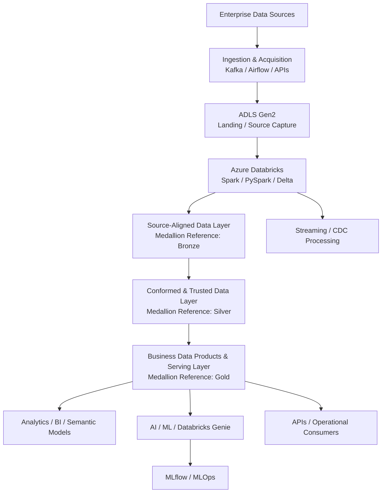
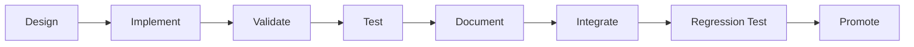

# Genie Insurance Platform

<div align="center">

## Enterprise Data, AI & Platform Engineering

<p>
  
  
  
  
</p>

**Azure · Databricks · Terraform · ADLS Gen2 · Delta Lake · Unity Catalog · PySpark · Kafka · AKS · Airflow · GitHub Actions · MLflow · MLOps · SRE**

</div>

---

## Overview

The **Genie Insurance Platform** demonstrates a production-oriented enterprise **Data and AI platform** built around secure infrastructure automation, governed data engineering, machine learning, AI-assisted analytics, Kubernetes integration, observability, and Site Reliability Engineering practices.

The platform is designed to ingest data from enterprise sources, process it through governed **Source-Aligned, Conformed & Trusted, and Business Data Products & Serving** layers (corresponding to the Databricks Medallion Bronze, Silver, and Gold pattern), and expose trusted data products for:

- Analytics and business intelligence
- Databricks AI/BI Genie
- Machine learning and MLOps
- APIs and integration services
- Downstream enterprise applications

---

## Table of Contents

- [Platform Architecture](#platform-architecture)
- [Core Technologies](#core-technologies)
- [Platform Capabilities](#platform-capabilities)
- [Infrastructure Automation](#infrastructure-automation)
- [CI/CD Delivery Model](#cicd-delivery-model)
- [Security and Governance](#security-and-governance)
- [Data Engineering](#data-engineering)
- [AI and Machine Learning](#ai-and-machine-learning)
- [Kubernetes / AKS](#kubernetes--aks)
- [Reliability and SRE](#reliability-and-sre)
- [Implementation Methodology](#implementation-methodology)
- [Repository Structure](#repository-structure)
- [Repository Traffic](#repository-traffic)
- [Project Objective](#project-objective)

---

## Platform Architecture



### Enterprise Data Lifecycle Model

The implementation uses business-purpose layer names as the primary terminology.
The familiar Databricks Medallion names remain as references for architecture discussions and onboarding.

| Enterprise Layer | Databricks Reference | Purpose |
|---|---|---|
| **Source-Aligned Data Layer** | **Bronze** | Preserves source fidelity, ingestion history, provenance, and replay capability with minimal business transformation. |
| **Conformed & Trusted Data Layer** | **Silver** | Applies schema enforcement, data-quality rules, standardization, deduplication, enrichment, reference-data alignment, and cross-domain conformance. |
| **Business Data Products & Serving Layer** | **Gold** | Publishes governed domain data products, dimensional models, semantic datasets, KPIs, aggregates, and consumption-ready structures for BI, AI, ML, APIs, and operational consumers. |

> **Naming principle:** `Bronze`, `Silver`, and `Gold` describe Medallion data-quality stages. In this repository, enterprise layer names describe the actual responsibility and contract of each layer.

### Architectural Intent

| Component | Purpose |
|---|---|
| **Enterprise Sources** | Provide operational, transactional, event, file, database, SaaS, and API-based source data. |
| **Ingestion & Acquisition** | Capture batch, streaming, CDC, and API-based data through controlled ingestion patterns. |
| **Landing / Source Capture** | Provide durable source landing and ingestion boundaries before governed transformation. |
| **Azure Databricks** | Provide distributed data processing with Spark, PySpark, SQL, Delta Lake, and governed workloads. |
| **Source-Aligned Data Layer** | Preserve source-aligned, replayable, auditable data with minimal transformation. |
| **Conformed & Trusted Data Layer** | Create validated, standardized, deduplicated, enriched, and reusable enterprise datasets. |
| **Business Data Products & Serving Layer** | Publish domain-owned, business-ready data products and semantic serving structures. |
| **Analytics / AI / ML / APIs** | Consume governed data products for reporting, Databricks Genie, ML, APIs, and downstream applications. |
| **MLflow / MLOps** | Track, register, deploy, govern, and monitor machine-learning models. |

---

## Core Technologies

| Domain | Technologies |
|---|---|
| **Cloud** | Microsoft Azure |
| **Data Platform** | Azure Databricks |
| **Storage** | ADLS Gen2 |
| **Data Format** | Delta Lake |
| **Processing** | Apache Spark, PySpark, SQL |
| **Streaming** | Apache Kafka |
| **Orchestration** | Apache Airflow |
| **Infrastructure as Code** | Terraform |
| **CI/CD** | GitHub Actions |
| **Containers** | AKS / Kubernetes |
| **Governance** | Unity Catalog |
| **AI / Analytics** | Databricks AI/BI Genie |
| **ML / MLOps** | MLflow |
| **Operations** | Observability, DevOps, SRE |

---

## Platform Capabilities

The platform is designed to demonstrate the following production-oriented capabilities:

### Infrastructure and Delivery

- Infrastructure as Code with Terraform
- Secure GitHub-to-Azure authentication using OIDC
- Automated CI/CD with GitHub Actions
- Environment-specific configuration
- Controlled infrastructure deployment workflows
- Post-deployment validation and recovery procedures

### Data Engineering

The platform follows an enterprise data-lifecycle model aligned with the Databricks Medallion Architecture.

### Source-Aligned Data Layer
**Medallion reference: Bronze**

The **Source-Aligned Data Layer** is the durable system-of-record boundary for ingested data. Its purpose is not simply to hold "raw data"; it preserves enough source fidelity and ingestion metadata to support auditability, replay, recovery, lineage, and downstream reprocessing.

**Primary responsibilities:**

- Preserve source-system fidelity
- Capture batch, streaming, and CDC data
- Retain ingestion and provenance metadata
- Maintain append-oriented historical records where appropriate
- Support replay and downstream reprocessing
- Isolate source schema changes from downstream business consumers
- Quarantine technically unreadable or malformed records when required
- Provide an auditable ingestion boundary

**Typical enterprise objects:**

- Source-aligned Delta tables
- CDC event tables
- Raw API payloads
- File-ingestion tables
- Ingestion control metadata
- Schema-drift metadata
- Quarantine records

---

### Conformed & Trusted Data Layer
**Medallion reference: Silver**

The **Conformed & Trusted Data Layer** converts source-oriented datasets into reliable enterprise information assets. This is where data contracts, validation, conformance, identity resolution, reference-data alignment, and reusable business transformations are applied.

**Primary responsibilities:**

- Schema enforcement and standardization
- Data-quality validation
- Deduplication
- Null and invalid-value handling
- Type normalization
- Reference-data enrichment
- Business-rule application
- Entity resolution
- Cross-source integration
- Cross-domain conformance
- Privacy and security transformations where required
- Creation of reusable detailed datasets for analytics and data science

**Insurance examples:**

- Conformed policy records
- Trusted claim transactions
- Standardized customer and household entities
- Advisor and producer master views
- Coverage and product reference models
- Validated payment and transaction datasets

---

### Business Data Products & Serving Layer
**Medallion reference: Gold**

The **Business Data Products & Serving Layer** publishes governed, consumption-ready assets around business domains and measurable outcomes. This layer should expose stable business contracts rather than implementation-specific transformation details.

**Primary responsibilities:**

- Domain-oriented data products
- Dimensional and analytical models
- Business measures and KPIs
- Aggregations and summaries
- Semantic datasets
- Databricks AI/BI Genie-ready datasets
- Machine-learning features and serving datasets where appropriate
- Reporting and dashboard serving structures
- API and operational-consumption datasets
- Certified enterprise data products

**Insurance data-product examples:**

- Claims Performance Data Product
- Policy Retention Data Product
- Customer 360 Data Product
- Advisor Performance Data Product
- Product Profitability Data Product
- Claims Turnaround KPI Model
- Executive Insurance Operations Scorecard
- Governed Genie Semantic Dataset

### Enterprise Data Flow

```text
Enterprise Source Systems
          |
          v
Ingestion & Source Capture
          |
          v
Source-Aligned Data Layer
(Medallion: Bronze)
          |
          v
Conformed & Trusted Data Layer
(Medallion: Silver)
          |
          v
Business Data Products & Serving Layer
(Medallion: Gold)
          |
          +----> BI / Executive Analytics
          +----> Databricks AI/BI Genie
          +----> Machine Learning / Feature Consumption
          +----> APIs / Microservices
          +----> Operational Applications
          +----> Governed Data Sharing
```

### Recommended Unity Catalog Naming

For a production implementation, avoid making `bronze`, `silver`, and `gold` the primary business-facing catalog names.

A stronger domain-oriented convention is:

```text
<domain>_<environment>.<data_lifecycle_schema>.<data_object>
```

Example:

```text
claims_prod.source_aligned.claim_events
claims_prod.conformed.claim_transactions
claims_prod.data_products.claims_performance

policy_prod.source_aligned.policy_changes
policy_prod.conformed.policy
policy_prod.data_products.policy_retention

customer_prod.source_aligned.customer_events
customer_prod.conformed.customer_master
customer_prod.data_products.customer_360
```

This keeps the data architecture understandable to enterprise teams while preserving a direct conceptual mapping to:

```text
source_aligned  -> Medallion Bronze
conformed       -> Medallion Silver
data_products   -> Medallion Gold
```

> The exact Unity Catalog hierarchy should be finalized around environment isolation, domain ownership, governance boundaries, and organizational operating model rather than around color names alone.

---

## AI and Machine Learning

The platform supports governed AI and machine-learning workloads using trusted enterprise data.

### Supported Capabilities

- Databricks AI/BI Genie
- Natural-language-to-SQL analytics
- Governed semantic datasets
- MLflow experiment tracking
- Model registration
- Model deployment
- Feature engineering
- GPU-enabled machine-learning workloads
- MLOps pipelines
- AI-agent integration

### ML Lifecycle

```text
Curated Data
    |
    v
Feature Engineering
    |
    v
Model Training
    |
    v
MLflow Experiment Tracking
    |
    v
Model Registration
    |
    v
Model Deployment
    |
    v
Monitoring / Retraining
```

---

## Kubernetes / AKS

AKS is used where container orchestration provides a better workload boundary than Databricks.

### Typical AKS Workloads

- APIs
- Microservices
- AI services
- Inference services
- Integration services
- Platform utilities
- Independently scalable container workloads

> **Design principle:** Databricks remains the primary compute plane for distributed data engineering, Spark processing, governed analytics, and data-centric machine-learning workloads. AKS is used for independently deployable containerized services.

---

## Reliability and SRE

Production reliability practices include:

- Platform monitoring
- Centralized logging
- Alerting
- Health checks
- Deployment validation
- Rollback procedures
- SLI and SLO monitoring
- Error-budget management
- Incident response
- Operational runbooks
- Disaster-recovery planning

### Reliability Lifecycle

```text
Observe
   |
   v
Measure
   |
   v
Alert
   |
   v
Respond
   |
   v
Recover
   |
   v
Improve
```

---

## Implementation Methodology

Each platform capability is implemented and validated independently before being integrated into the broader environment.



### Delivery Principles

| Stage | Objective |
|---|---|
| **Design** | Define architecture, dependencies, security boundaries, and acceptance criteria. |
| **Implement** | Build the capability as an isolated, version-controlled unit. |
| **Validate** | Confirm syntax, configuration, dependencies, and deployment readiness. |
| **Test** | Verify expected functional and technical behavior. |
| **Document** | Capture implementation steps, validation commands, known issues, and recovery procedures. |
| **Integrate** | Connect the capability with the existing platform. |
| **Regression Test** | Verify that integration did not break previously validated functionality. |
| **Promote** | Move the validated implementation into the next environment or release stage. |

---

## Repository Structure

```text
genie-insurance-platform/
│
├── docs/
│   └── Architecture and implementation documentation
│
├── infra/
│   └── bootstrap/
│       └── Terraform bootstrap infrastructure
│
├── .gitignore
├── About-Me.md
├── Project-Architecture.md
└── README.md
```

As the implementation expands, the repository can continue to organize infrastructure, data engineering, governance, orchestration, ML/MLOps, Kubernetes, observability, testing, and operational runbooks into dedicated modules and folders.

---

## Repository Traffic

> [!IMPORTANT]
> The green **REPOSITORY VISITS** badge at the top of this README is a public README visit counter. It is **not the same metric as GitHub's official Unique Visitors**.

GitHub's official repository traffic information is available to authorized repository users under:

**Insights → Traffic**

GitHub exposes official page-view and unique-visitor breakdowns for the previous **14 days**. Maintaining true monthly, quarterly, yearly, or all-time historical traffic requires collecting and storing those metrics outside the README.

### Traffic Views

[](#daily-traffic)
[](#weekly-traffic)
[](#monthly-traffic)
[](#quarterly-traffic)
[](#yearly-traffic)
[](#all-time-traffic)

### Traffic Metrics

Traffic can be analyzed across **daily, weekly, monthly, quarterly, yearly, and all-time** periods when historical GitHub traffic data is collected and retained externally.

<!--
TRAFFIC GRAPH INTEGRATION TEMPLATE

Activate the graph blocks only after a traffic-collector endpoint is configured.

Replace:
https://YOUR-TRAFFIC-ENDPOINT.example.com

Expected endpoint pattern:
GET /graph.svg?repo=skalyanapu-sre/genie-insurance-platform&period=<period>

Supported period examples:
- daily
- weekly
- monthly
- quarterly
- yearly
- all

Example:

<p align="center">
  
</p>
-->

---

## Project Objective

The goal of the **Genie Insurance Platform** is to demonstrate a complete enterprise implementation spanning:

**Architecture → Infrastructure → Data Engineering → Governance → DevOps → MLOps → AI → Kubernetes → Observability → SRE**

The implementation emphasizes engineering practices that are:

- **Secure**
- **Repeatable**
- **Testable**
- **Governed**
- **Observable**
- **Production-oriented**

---

<div align="center">

### Genie Insurance Platform

**Enterprise Data · AI · Platform Engineering · DevOps · SRE**

</div>
