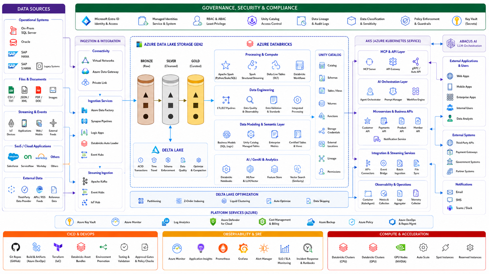

# What You Will Learn

## Project Architecture

By completing the **Genie Insurance Platform** project end to end, you will learn how a real enterprise data and AI platform is designed, secured, deployed, tested, and operated—not just how to run a few Databricks notebooks.

- **Enterprise cloud architecture:** how Azure networking, ADLS Gen2, Azure Databricks, identity, monitoring, and optional AKS fit together.

- **Infrastructure as Code:** how to build reusable Terraform modules, separate Terraform state, manage DEV/UAT/PROD environments, and deploy infrastructure safely.

- **Enterprise identity and security:** Microsoft Entra ID, service principals, managed identities, GitHub OIDC, least privilege, RBAC, Unity Catalog permissions, and secretless authentication.

- **Unity Catalog governance:** catalogs, schemas, storage credentials, external locations, Volumes, managed storage, workspace bindings, lineage, and controlled access.

- **Production data engineering:** ingestion from CSV/JSON, databases, documents, and Kafka into Bronze, Silver, and Gold Delta Lake layers.

- **Data contracts and quality:** schema enforcement, malformed-record handling, quarantine tables, duplicate detection, referential-integrity checks, reconciliation, and idempotent processing.

- **Insurance and Payment Integrity modeling:** claims, claim lines, payments, members, providers, policies, contracts, authorizations, status history, duplicate claims, overpayments, underpayments, excessive units, out-of-network claims, and aging claims.

- **Streaming engineering:** Kafka producers, Spark Structured Streaming, checkpoints, offsets, replay, event-time processing, external NWS/USGS streams, and resilient streaming pipelines.

- **Spark and Delta Lake:** PySpark transformations, grain-safe joins, Delta MERGE, partitioning, optimization, deterministic processing, and restart-safe pipelines.

- **Semantic modeling:** Gold business models, reusable KPI definitions, Unity Catalog Metric Views, certified dimensions, and certified financial measures.

- **Databricks Genie:** building a domain-specific Genie Agent with governed datasets, business terminology, instructions, sample questions, approved joins, validated SQL, and benchmark tests.

- **MCP architecture:** exposing Genie and governed Databricks capabilities through Model Context Protocol without giving AI applications unrestricted lakehouse access.

- **Abacus.AI integration:** using Abacus as the conversational and orchestration layer while Databricks remains the authoritative analytics and semantic engine.

- **CI/CD and SDLC:** Git branching, pull requests, GitHub Actions, Terraform plans, Databricks Bundles, environment promotion, automated testing, approvals, rollback, and immutable deployment.

- **Observability and SRE:** pipeline metrics, API/MCP latency, error rates, Grafana/Prometheus, Azure Monitor, alerts, SLOs, incident runbooks, RTO/RPO, and production readiness.

- **Solution-architect thinking:** understanding not only **how** every component works, but **why it exists, what problem it solves, what alternatives exist, and how all layers integrate into one governed enterprise platform**.

At the end, you should be able to explain the platform from both perspectives:

- **Hands-on engineer:** how to build, operate, validate, and troubleshoot every layer.
- **Solution architect:** how to defend the security, governance, scalability, reliability, cost, and architecture decisions.
